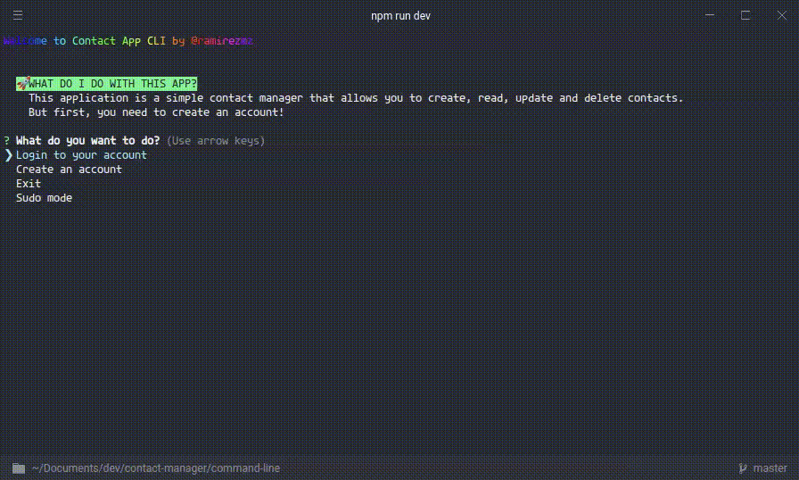
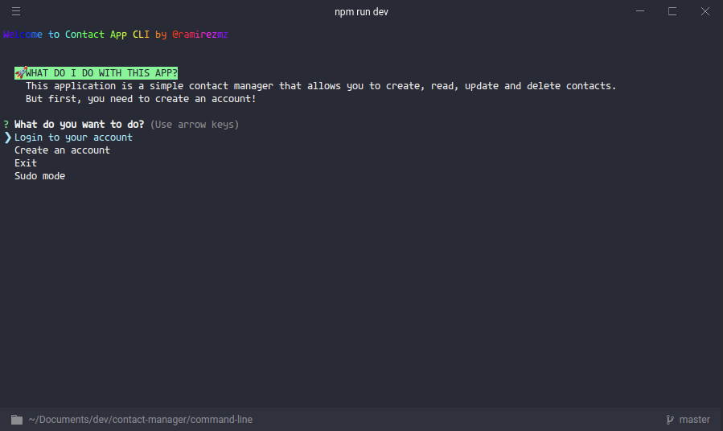

# Contact Manager project

This project calls contact manager, and it's special! why? the front end is a command line interface (CLI).
You can run in your machine, just need to have Nodejs!

In this project, you can do the following:

- Create an account
- Login in your account
- Create a contact
- Read the contacts
- Remove a contact
- Update a contact
- Logout

## Demo

## Tools

This project uses the following tools:

- [Node.js](https://nodejs.org/en/)
- [Chalk](https://www.npmjs.com/package/chalk)
- [Fliget](https://www.npmjs.com/package/figlet)
- [inquirer](https://www.npmjs.com/package/inquirer)
- [Gradient-string](https://www.npmjs.com/package/gradient-string)
- [MongoDB](https://www.mongodb.com/)
- [Mongoose](https://mongoosejs.com/)
- [Docker](https://www.docker.com/)
- [Mocha](https://mochajs.org/)
- [Sinon](https://sinonjs.org/)

## How to run

1. Clone the repository
2. Enter the project directory `cd contact-manager/command-line`
3. Install the dependencies with `npm install`
4. Run the application with `npm run dev`
